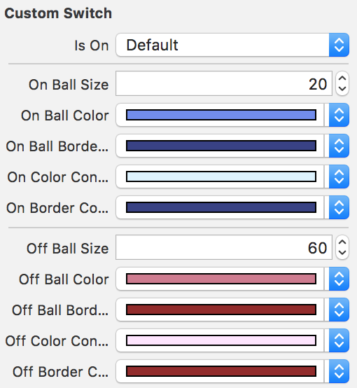

# HTCustomSwitch
Simple framework to custom UISwitch.

## DEMO

### Default


### Custom


## Installation

### Cocoapods

Install Cocoapods if need be.

```bash
$ gem install cocoapods
```

Add `HTCustomSwitch` in your `Podfile`.

```ruby
use_frameworks!

pod 'HTCustomSwitch'
```

Then, run the following command.

```bash
$ pod install
```

### Manual

Just copy only `HTCustomSwitch` file to your project. That's it.

## Usage

### INIT

Firstly, import `HTCustomSwitch`.

```swift
import HTCustomSwitch
```

Then, using initializer.

```swift
let myCustomUISwitch = HTCustomSwitch(frame: CGRect(x: 200, y: 200, width: 80, height: 50))
```

Or, you can create it with storyboard by just changing class of any `UIView` to `HTCustomSwitch`.

### Properties

-  On Ball Size:
```swift
myCustomUISwitch.onBallSize = 'CGFloat'
```
- On Ball Color:
```swift
myCustomUISwitch.onBallColor = 'UIColor'
```
- On Container Color:
```swift
myCustomUISwitch.onColorContainer = 'UIColor'
```
- On Container Border Color:
```swift
myCustomUISwitch.onColorContainer = 'UIColor'
```
-  Off Ball Size:
```swift
myCustomUISwitch.offBallSize = 'CGFloat'
```
- Off Ball Color:
```swift
myCustomUISwitch.offBallColor = 'UIColor'
```
- Off Container Color:
```swift
myCustomUISwitch.offColorContainer = 'UIColor'
```
- Off Container Border Color:
```swift
myCustomUISwitch.offColorContainer = 'UIColor'
```

- Storyboard:<br />


## License

Released under the MIT license. See LICENSE for details.
